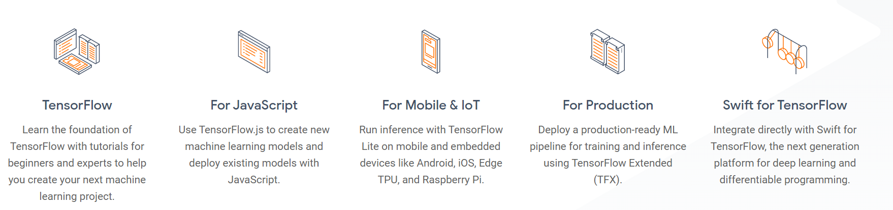

## Introduction to TensorFlow

TensorFlow makes it easy for beginners and experts to create machine learning models for desktop, mobile, web, and cloud. 

Learn how to build `deep learning applications with TensorFlow`. This course was developed by the `Clientoclarify.ai` team and **Reddy Prasade** as a practical approach to deep learning for software developers. You'll get hands-on experience building your own state-of-the-art image classifiers and other deep learning models. You'll also use your TensorFlow models in the real world on mobile devices, in the cloud, and in browsers. Finally, you'll use advanced techniques and algorithms to work with large datasets. By the end of this course, you'll have all the skills necessary to start creating your own AI applications.If you are a software developer who wants to build scalable AI-powered algorithms, you need to understand how to use the tools to build them. This course is part of the upcoming Deep Learning in Tensorflow Specialization and will teach you best practices for using TensorFlow, a popular open-source framework for Deep learning. 

The Deep Learning Specialization from Reddy Prasad teach the most important and foundational principles of Tensorflow and Deep Learning. This new Clientoclarify.ai TensorFlow Specialization teaches you how to use TensorFlow to implement those principles so that you can start building and applying scalable models to real-world problems. To develop a deeper understanding of how neural networks work.
